# PREMIER LEAGUE QUIZ

[Visit the website here](https://jakbul.github.io/Premier-League-Quiz/)

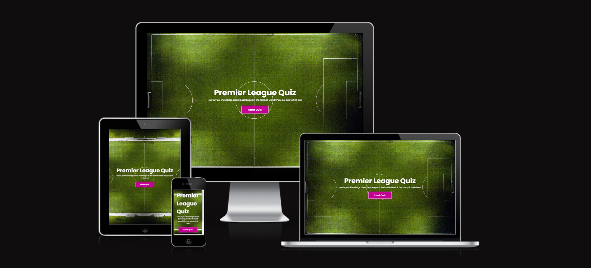

Created to show ability of creating interactive webpage using JavaScript. This project was made for educational purposes only.

This website is made up of only one webpage with three separate sections: Main Page, Quiz Section and Result Box.

The business goals for this website are:

1. To promote Premier League and knowledge about the best league in the world
2. To inspire users to play the quiz
3. To reach as many people as possible with the quiz

The user goals of this website are:
1. As a first-time visitor, I want to easily find buttons to play the game and interact with the game
2. As a recurring or first-time visitor, I want to find information of how exactly to play the game
3. As a recurring or first-time visitor, I want to have fun with questions and see my result of the quiz

## UX

### **Strategy**

Considering the core UX principles, I first started to think about the strategy for this website and defined who the target users would be and what features/technologies they would want.

Premier League Quiz target users are:
* Aged 01-99
* Football lovers, fans, anyone who follows football in general as Premier League is the most watched league in the world
* Have an interest to test their knowledge

What these users would be looking for:
* Clear information and easy-to-use interaction
* Good & simple looking design that provides inspiration and make the quiz look desirable

This quiz has been built to offer all of these things. An effort was taken to provide as intuitive interaction as possible for every user visiting the webpage.

Due to the age group of the users, it is assumed that most users will be viewing the site not only on their mobile phones, but also on the tablets or computers. Therefore, creating something responsive is integral to the design.

### **Scope**

In order to achieve the desired user & business goals, the following features will be included in this release:

- Simple Home section with button to Start Quiz
- Popup window explaining how to play the Quiz and options of either Exit or Play
- Quiz Section which contains 10 Questions with 4 possible answers
- Every question has only one correct answer
- Only after answering each question, user can move to another one
- After the last question the result will be shown in Result Box section
- User can go back to menu of the game if needs or play again upon clicking on button Try Again 

### **Structure** 

This is one page website to reach simplicity.

I chose the following order for the gameplay 'Main Page > Pop up window with rules > Quiz Section > Result Box', as I felt this would allow the whole flow of quiz to be digested in the best way.

I also chose to use maximum of 10 questions and double-checked them on Wikipedia where are tracked all of English Premier League records. 

### **Skeleton**

As this project is mostly about User Interaction, I decided to focus on gameplay and quality of JavaScript code. Therefore, I used as little text and images as possible. 

I intentionally used CSS styling to make interaction with this quiz funny and handy, for example with text styling, hovering effect on buttons or showing the right answer after clicking the wrong one.

Last but not least, I added responsiveness to allow user play the quiz on a different devices. 

I felt that all mentioned above helps to provide the best User Experience and highlight purpose of this project.

### **Surface**

Important to mention - this project had to pass all of accessibility critera, that's why I had to choose type of colours and backgrounds that will easily pass them.

### Colour Scheme

I chose a colour palette based around white & black as these colours are elegant and simple to implement into design. I added darker violet color for buttons and headings. Additionally, I chose to use another colours for hover effects and box shadowing.

- `#ffffff` used for primary text or background
- `#000000` used for secondary text
- `#C40094` used for primary highlights
- `#09001D` used for secondary highlights
- `#09001D` and `#950170` used for hover effects
- `#00A63D` and `#A60045` used for correct or wrong answer

I used [coolors.co](https://coolors.co/c40094-09001d-ffffff-000000-950170-00a63d-a60045) to help me generate my colour palette.

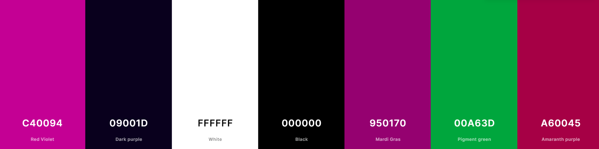

### Typography

I decided to use Google font 'Poppins' with different font weights throughout the project thanks to it's elegance. I left font 'sans-serif' as back-up font style if anything goes wrong with Google link. 

- [Poppins](https://fonts.google.com/specimen/Poppins)

- [Sans-serif](https://fonts.google.com/knowledge/glossary/sans_serif)

## Features

This is a fully responsive website that was designed with an eye for responsiveness as most likely it will be viewed on different screen sizes. The website is made up of only one webpage with three separate sections: Main Page with Popup Window, Quiz Section and Result Box. We access them through JavaScript with 'click' Event Listeners reacting to user's interaction. More deeply, all sections are on the same webpage and in the beginning have in CSS opacity:0, only Main Page has opacity:1 and therefore is visible from the start.

Lastly, all of headings, buttons and hover effects use similar colors to build an easy-to-follow apperance

### Existing Features

- **Main Page**

Main Page contains background image of football pitch and heading with one paragraph. Below that is button for starting the quiz and also with hover effect after hovering. As mentioned above, I made it simple and highlighted the only purpose of this section - playing the game.

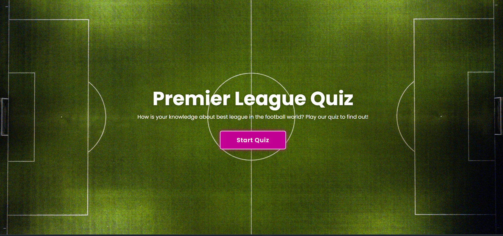

- **Popup Window**

When user wants to start the quiz on Main Page, all window becomes blur and this window pops up - 5 rules for how to play the game. User can then go back to Main Page or actually launch the quiz when clicks on the button Play. In this section, I would like to highlight usage of chosen colors and hover effects. Also, window pops up with a small scale transition in order to add more design interaction. 

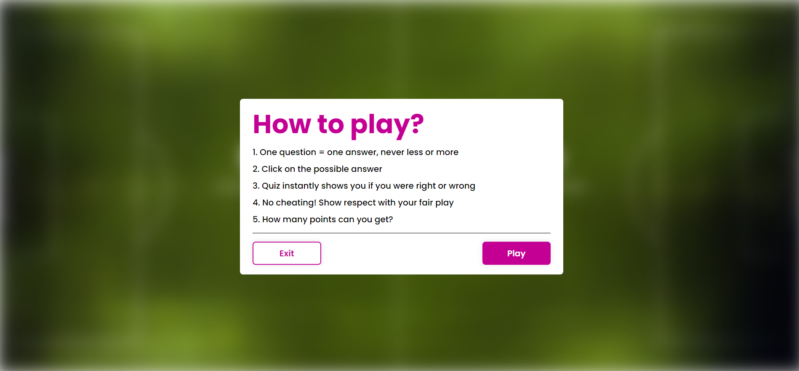

- **Quiz Section**

When user actually launch the game, Main Page with Popup Window disappears and quiz begins. Quiz contains 10 questions and user can choose one from four possible answers. Question dodging is impossible as user can not move on another question when didn't answer the actual one. Only after each answer the button 'Next' becomes usable. 

When user answers correctly, the button of clicked answer becomes green and user gets one point. When user answers wrong, the button of clicked answer becomes red and the actual right answer button becomes green, as shown in second screenshot below. After the answer, user can move to another question when clicks on button 'Next'. Then new question appears and process repeats.

In this section, I added JavaScript to count achieved score for each individual game and also counter for questions. I would say this is the most important section of all because of focus on chosen UX principles.

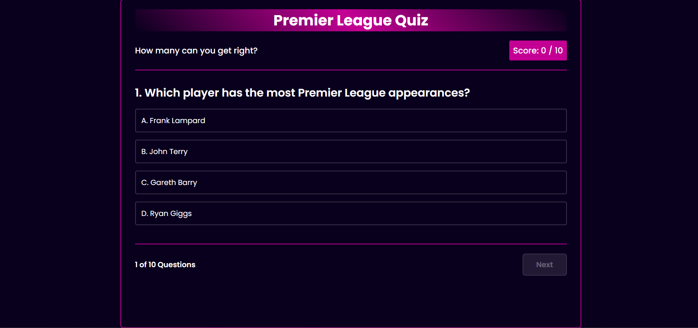
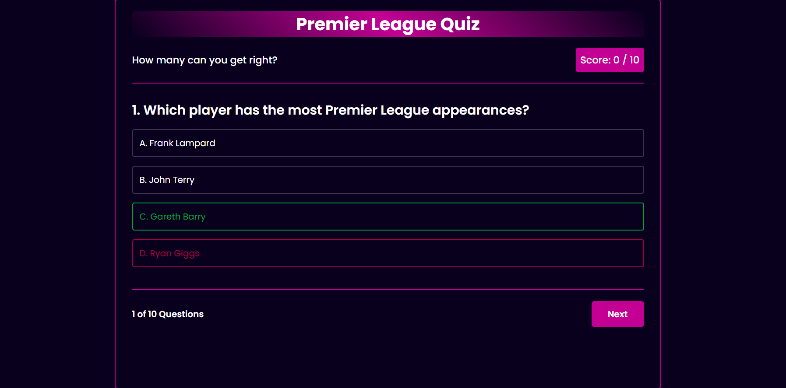

- **Result Box**

When user answers on last 10th question and clicks on button 'Next', quiz ends and Quiz Section disappear. Then, Result Box appears with result which user achieved. In the example below I answered only 2 questions out of 10 correctly, therefore my result is 20%. 

User can decide to go back to Main Page or Try Again. However, user has to start from first question and score 0 again. 

Again, I would like to highlight usage of chosen colors, hover effects, design and responsiveness for following our UX goals.

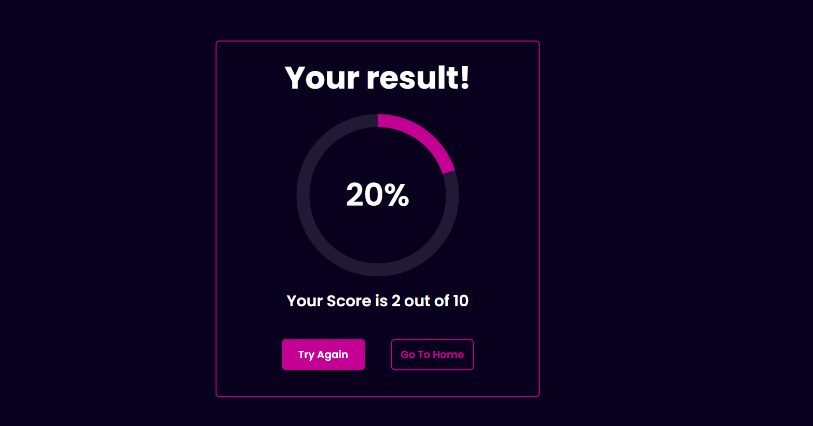

### Future Features

**BackEnd Language**
- I would like to implement work with BackEnd language such as Python to be able to work with database and implement score leaderboard. Then, I could create different quiz sections to achieve more competitiveness

**Bootstrap**
- While implementing BackEnd Language, I think it's important to upgrade responsiveness for the webpage when more sections would be added. Bootstrap could help me to create the right template to use with grid system

## Tools & Technologies Used

- [HTML](https://en.wikipedia.org/wiki/HTML) used for the main site content
- [CSS](https://en.wikipedia.org/wiki/CSS) used for the main site design and layout
- [JavaScript](https://en.wikipedia.org/wiki/JavaScript) used for user interaction on the site
- [Git](https://git-scm.com) used for version control (`git add`, `git commit`, `git push`)
- [GitHub](https://github.com) used for secure online code storage
- [GitHub Pages](https://pages.github.com) used for hosting the deployed front-end site
- [Gitpod](https://gitpod.io) used as a cloud-based IDE for development
- [Unsplash](https://www.unsplash.com/) used to find and download free images for project
- [Google Fonts](https://fonts.google.com/) used to obtain the fonts linked in the header and used in project
- [Google Developer Tools](https://developers.google.com/web/tools/chrome-devtools) used as a primary method of fixing spacing issues, finding bugs, and testing responsiveness across the project
- [Grammarly](https://www.grammarly.com/) used to fix the thousands of grammar errors across the project
- [Coloors](https://coolors.co/) used to create a colour palette for the design
- [W3C Markup Validation Service](https://validator.w3.org/) used to validate all HTML code written and used on this webpage
- [W3C CSS Validation Service](https://jigsaw.w3.org/css-validator/#validate_by_input) used to validate all CSS code written and used on this webpage
- [JSHint](https://jshint.com/) used to validate all JS code written and used on this webpage
- [AmIResponsive](http://ami.responsivedesign.is/) used to generate repsonsive image used in README file
- [Wikipedia](https://en.wikipedia.org/wiki/Premier_League_records_and_statistics) used to check correct answers 

## Media

| Source | Location | Type | Notes |
| --- | --- | --- | --- |
| [Unsplash](https://unsplash.com/photos/deGn9vSwXIM) | Main Page | image | Used as link in CSS code |

# Testing

## Code Validation

### HTML
I have used the recommended [HTML W3C Validator](https://validator.w3.org) to validate my HTML file.

| Page | W3C URL | Screenshot | Notes |
| --- | --- | --- | --- |
| Main Page | [W3C](https://validator.w3.org/nu/?doc=https%3A%2F%2Fjakbul.github.io%2FPremier-League-Quiz%2F) | 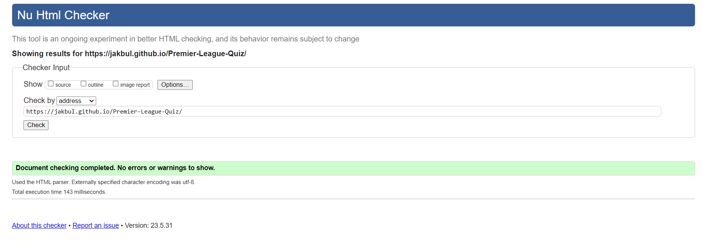 | Pass: No Errors |

### CSS
I have used the recommended [CSS Jigsaw Validator](https://jigsaw.w3.org/css-validator) to validate my CSS file.

| File | Jigsaw URL | Screenshot | Notes |
| --- | --- | --- | --- |
| style.css | [Jigsaw](https://jigsaw.w3.org/css-validator/validator?uri=https%3A%2F%2Fjakbul.github.io%2FPremier-League-Quiz%2F&profile=css3svg&usermedium=all&warning=1&vextwarning=&lang=en) | 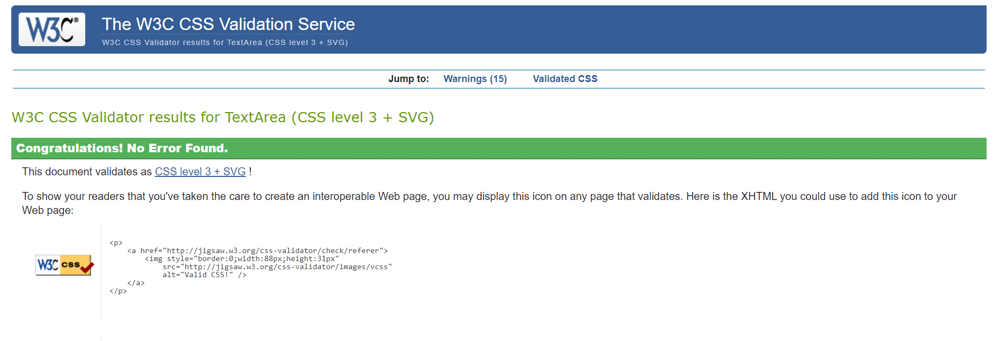 | Pass: No Errors, when validated by input - see screenshot. Note! Upon clicking on the link there may be shown some errors |

### JavaScript
I have used the recommended [JSHint](https://jshint.com/) to validate my JS file.

| File | Screenshot | Notes |
| --- | --- | --- |
| script.js | 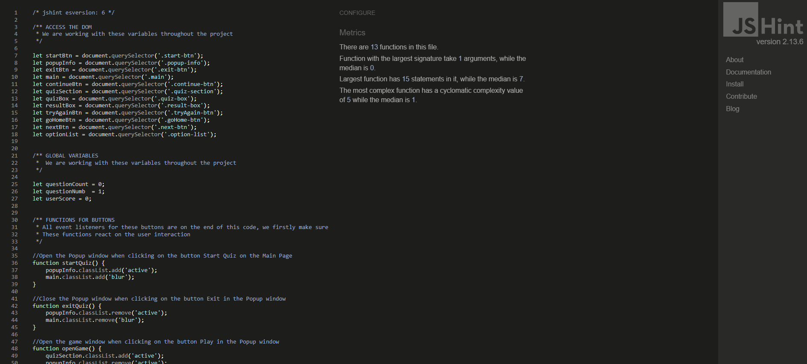 | Pass: No Errors, when validated by input - see screenshot. There have been few warnings regarding to ES6 standards |

## Browser Compatibility

I have tested my deployed project on multiple browsers to check for compatibility issues.

| Browser | Screenshot | Notes |
| --- | --- | --- |
| Chrome |  | Works as expected |
| Edge | 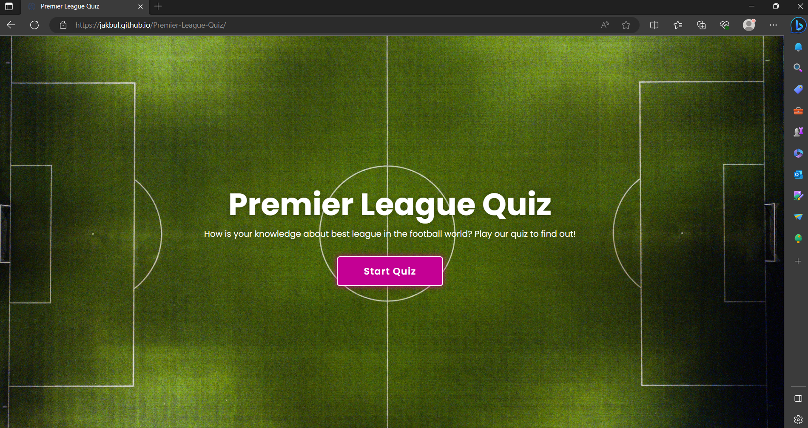 | Works as expected |
| Safari (phone) | 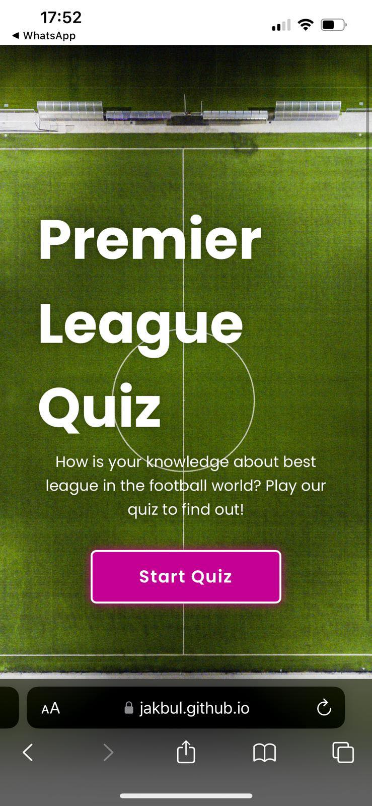 | Works as expected |

## Responsiveness

I have tested my deployed project on multiple devices to check for responsivity issues.

| Device | Screenshot | Notes |
| --- | --- | --- |
| Mobile iPhone 13 | 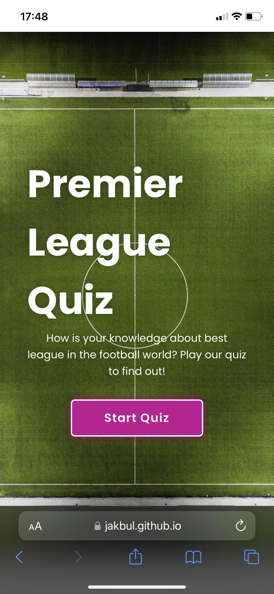 | Works as expected
| Mobile iPhone 10 | 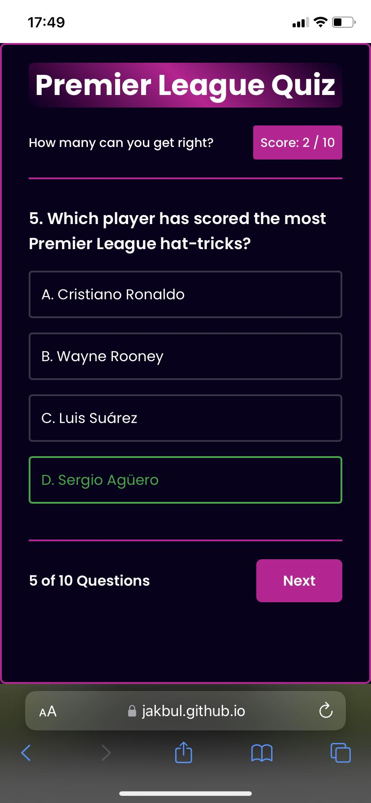 | Not getting full width of webpage on phone when turned to portrait orientation |
| Tablet (DevTools) | 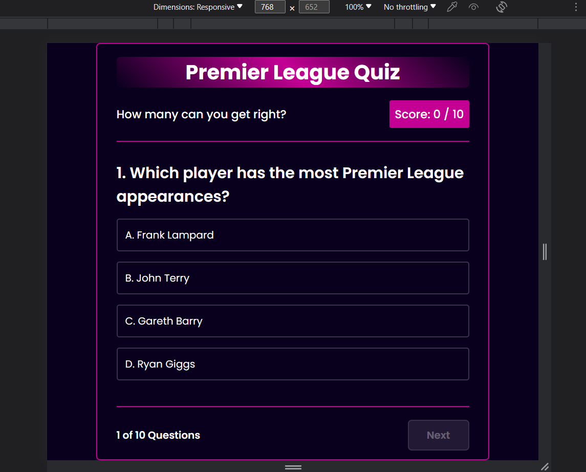 | Works as expected |
| Desktop |  | Works as expected |

## Lighthouse Audit

I have tested my deployed project using the Lighthouse Audit tool to check for any major issues.

| Page | Size | Screenshot | Notes |
| --- | --- | --- | --- |
| Home | Desktop | 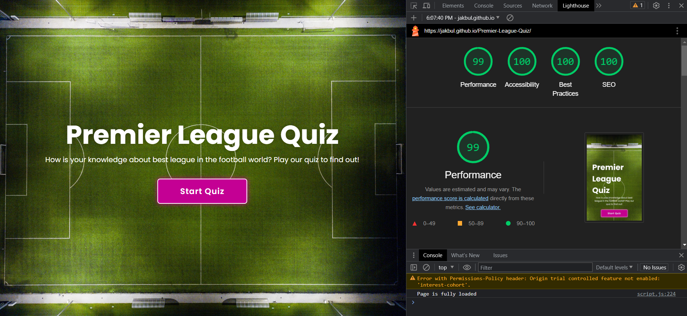 | One irrelevant warning |
| Home | Mobile | 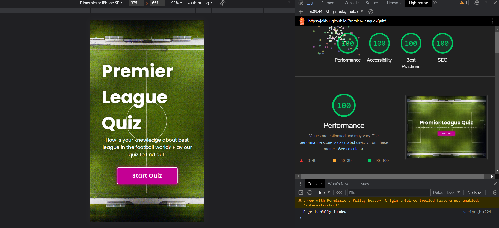 | One irrelevant warning |

## User Story Testing

| User Story | Screenshot | Comments |
| --- | --- | --- |
| As a first-time visitor, I want to easily find buttons to play the game and interact with the game |  | All the quiz is fully interactive and all starts on the Main Page  |
| As a recurring or first-time visitor, I want to find information of how exactly to play the game |  | That's the reason why I added this Popup Window |
| As a recurring or first-time visitor, I want to have fun with questions and see my result of the quiz |  | I implemented all UX principles |

## Known bugs and fixes

## Unfixed Bugs

There are no remaining bugs that I am aware of.

## Deployment

The site was deployed to GitHub Pages. The steps to deploy are as follows:
- In the [GitHub repository](https://github.com/JakBul/Premier-League-Quiz), navigate to the Settings tab 
- From the source section drop-down menu, select the **Main** Branch, then click "Save"
- The page will be automatically refreshed with a detailed ribbon display to indicate the successful deployment

The live link can be found [here](https://jakbul.github.io/Premier-League-Quiz)

### Local Deployment

This project can be cloned or forked in order to make a local copy on your own system.

#### Cloning

You can clone the repository by following these steps:

1. Go to the [GitHub repository](https://github.com/JakBul/Premier-League-Quiz) 
2. Locate the Code button above the list of files and click it 
3. Select if you prefer to clone using HTTPS, SSH, or GitHub CLI and click the copy button to copy the URL to your clipboard
4. Open Git Bash or Terminal
5. Change the current working directory to the one where you want the cloned directory
6. In your IDE Terminal, type the following command to clone my repository:
	- `git clone https://github.com/JakBul/Premier-League-Quiz.git`
7. Press Enter to create your local clone.

Alternatively, if using Gitpod, you can click below to create your own workspace using this repository.

Please note that in order to directly open the project in Gitpod, you need to have the browser extension installed.
A tutorial on how to do that can be found [here](https://www.gitpod.io/docs/configure/user-settings/browser-extension).

#### Forking

By forking the GitHub Repository, we make a copy of the original repository on our GitHub account to view and/or make changes without affecting the original owner's repository.
You can fork this repository by using the following steps:

1. Log in to GitHub and locate the [GitHub Repository](https://github.com/JakBul/Premier-League-Quiz)
2. At the top of the Repository (not top of page) just above the "Settings" Button on the menu, locate the "Fork" Button
3. Once clicked, you should now have a copy of the original repository in your own GitHub account

## Credits

| Source | Location | Notes |
| --- | --- | --- |
| [Markdown Builder](https://traveltimn.github.io/markdown-builder) | README | Tool to help generate the Markdown files |
| [Unsplash](https://www.unsplash.com/) | Main Page | Image of football pitch |

## Acknowledgements

- First and foremost, I would like to thank my Code Institute mentor Rohit for his support throughout the development of this project
- Secondly,  I would like to thank my Code Institute tutor, [Nigel Edwards](https://github.com/nigel-edwards) for his assistance and guidance from the very start start of studies
- In addition, I would like to thank the [Code Institute Slack community](https://code-institute-room.slack.com) for the moral support
- Last but not least, I would like to thank my partner Angi, for believing in me, and allowing me to make this transition into software development