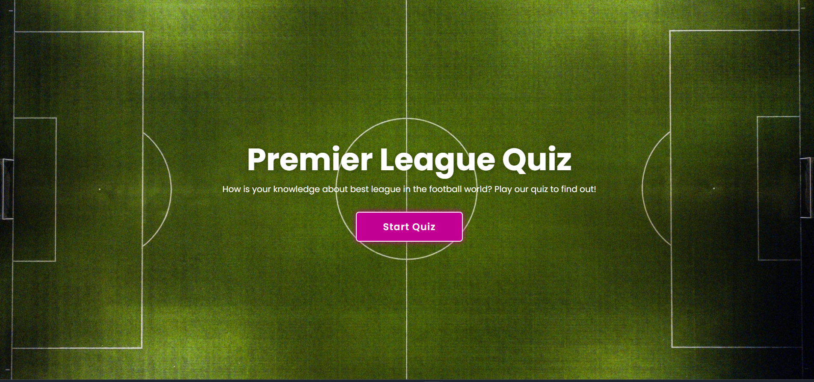
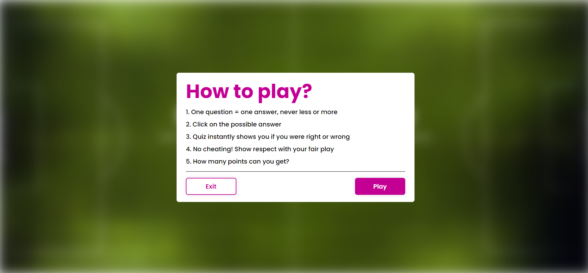
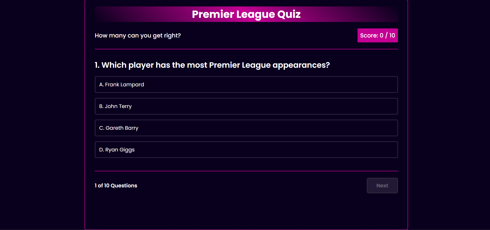
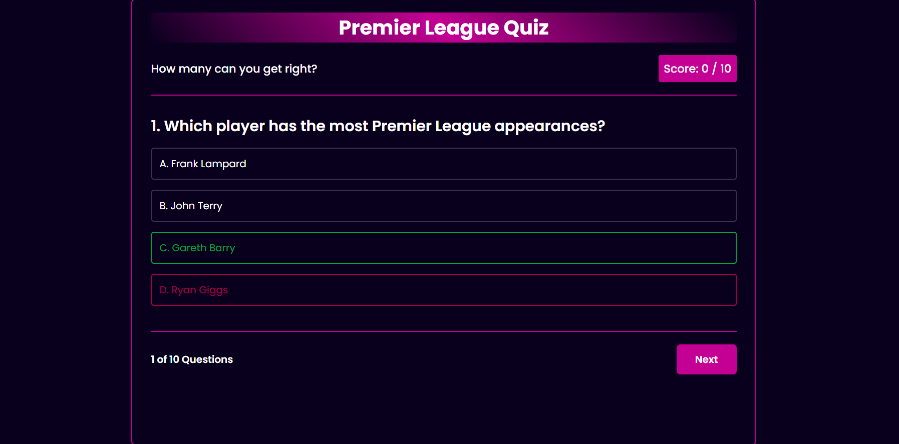
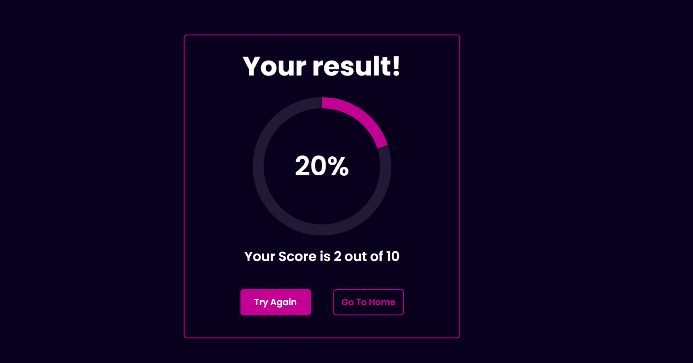
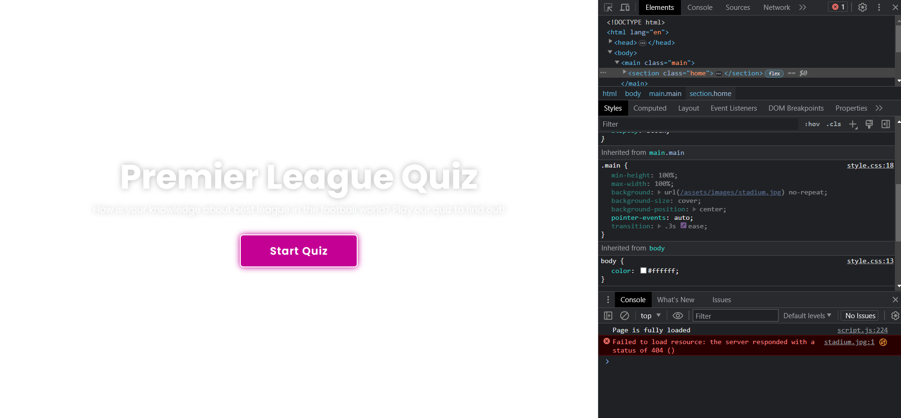
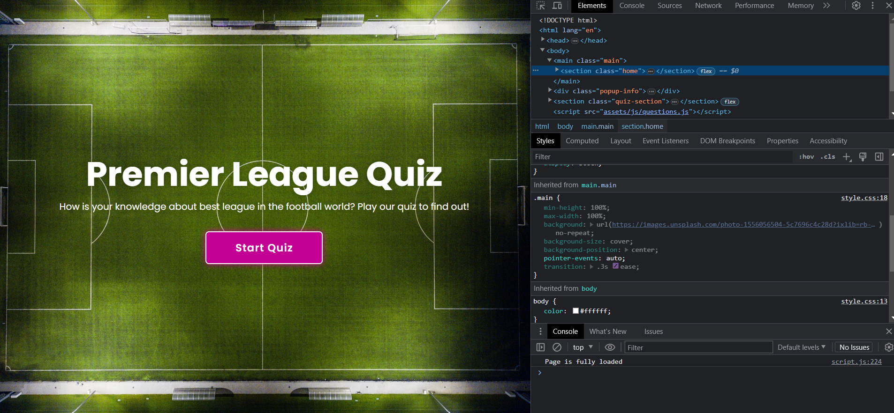

# PREMIER LEAGUE QUIZ

[Visit the website here](https://jakbul.github.io/Premier-League-Quiz/)

Created to show the ability to create an interactive webpage using JavaScript. This project was made for educational purposes only.

This website is made up of only one webpage with three separate sections: Main Page, Quiz Section and Result Box.

The business goals for this website are:

1. To promote Premier League and knowledge about the best league in the world
2. To inspire users to play the quiz
3. To reach as many people as possible with the quiz

The user goals of this website are:
1. As a first-time visitor, I want to easily find buttons to play the game and interact with the game
2. As a recurring or first-time visitor, I want to find information on how exactly to play the game
3. As a recurring or first-time visitor, I want to have fun with questions and see my result of the quiz

## UX

### **Strategy**

Considering the core UX principles, I first started to think about the strategy for this website and defined who the target users would be and what features/technologies they would want.

Premier League Quiz target users are:
* Aged 01-99
* Football lovers, fans, and anyone who follows football in general as Premier League is the most-watched league in the world
* Have an interest to test their knowledge

What these users would be looking for:
* Clear information and easy-to-use interaction
* Good & simple looking design that provides inspiration and makes the quiz look desirable

This quiz has been built to offer all of these things. An effort was taken to provide as intuitive interaction as possible for every user visiting the webpage.

Due to the age group of the users, it is assumed that most users will be viewing the site not only on their mobile phones but also on their tablets or computers. Therefore, creating something responsive is integral to the design.

### **Scope**

To achieve the desired user & business goals, the following features will be included in this release:

- Simple Home section with a button to 'Start Quiz'
- Popup window explaining how to play the Quiz and options of either Exit or Play
- Quiz Section which contains 10 Questions with 4 possible answers
- Every question has only one correct answer
- Only after answering each question, the user can move to another one
- After the last question the result will be shown in the Result Box section
- User can go back to the menu of the game if needs or play again upon clicking on the button Try Again 

### **Structure** 

This is one-page website to reach simplicity.

I chose the following order for the gameplay 'Main Page > Popup Window with rules > Quiz Section > Result Box', as I felt this would allow the whole quiz to be digested in the best way.

I also chose to use a maximum of 10 questions and double-checked them on Wikipedia where are tracked all of the English Premier League records. 

### **Skeleton**

As this project is mostly about User Interaction, I decided to focus on gameplay and the quality of JavaScript code. Therefore, I used as little text and images as possible. 

I intentionally used CSS styling to make interaction with this quiz funny and handy, for example with text styling, hovering effect on buttons or showing the right answer after clicking the wrong one.

Last but not least, I added responsiveness to allow users to play the quiz on different devices. 

I felt that all mentioned above helps to provide the best User Experience and highlight the purpose of this project.

### **Surface**

Important to mention - this project had to pass all of the accessibility criteria, that's why I had to choose the type of colors and backgrounds that will easily pass them.

### Colour Scheme

I chose a color palette based around white & black as these colors are elegant and simple to implement into the design. I added darker violet color for buttons and headings. Additionally, I chose to use other colors for hover effects and box shadowing.

- `#ffffff` used for primary text or background
- `#000000` used for secondary text
- `#C40094` used for primary highlights
- `#09001D` used for secondary highlights
- `#09001D` and `#950170` used for hover effects
- `#00A63D` and `#A60045` used for correct or wrong answer

I used [coolors.co](https://coolors.co/c40094-09001d-ffffff-000000-950170-00a63d-a60045) to help me generate my color palette.

### Typography

I decided to use Google font 'Poppins' with different font weights throughout the project thanks to its elegance. I left the font 'sans-serif' as a backup font style if anything goes wrong with the Google link. 

- [Poppins](https://fonts.google.com/specimen/Poppins)

- [Sans-serif](https://fonts.google.com/knowledge/glossary/sans_serif)

## Features

This is a fully responsive website that was designed with an eye for responsiveness as most likely it will be viewed on different screen sizes. The website is made up of only one webpage with three separate sections: Main Page with Popup Window, Quiz Section and Result Box. We access them through JavaScript with 'click' Event Listeners reacting to the user's interaction. More deeply, all sections are on the same webpage and in the beginning have in CSS opacity:0, only Main Page has opacity:1 and therefore is visible from the start.

Lastly, all of the headings, buttons and hover effects use similar colors to build an easy-to-follow appearance.

### Existing Features

- **Main Page**

Main Page contains the background image of a football pitch and a heading with one paragraph. Below that is a button for starting the quiz and also with a hover effect after hovering. As mentioned above, I made it simple and highlighted the only purpose of this section - playing the game.

- **Popup Window**

When a user wants to start the quiz on Main Page, all window becomes blurred and this window pops up - 5 rules for how to play the game. User can then go back to Main Page or launch the quiz when clicks on the button Play. In this section, I would like to highlight the usage of chosen colors and hover effects. Also, a window pops up with a small-scale transition to add more design interaction. 

- **Quiz Section**

When the user launches the game, Main Page with Popup Window disappears and the quiz begins. The quiz contains 10 questions and the user can choose one from four possible answers. Question dodging is impossible as the user can not move on to another question when didn't answer the actual one. Only after each answer the button 'Next' becomes usable. 

When the user answers correctly, the button of the clicked answer becomes green and the user gets one point. When the user answers wrong, the button of the clicked answer becomes red and the actual right answer button becomes green, as shown in the second screenshot below. After the answer, the user can move to another question when clicks on the button 'Next'. Then the new question appears and the process repeats.

In this section, I added JavaScript to count the achieved score for each game and also a counter for questions. I would say this is the most important section of all because of the focus on chosen UX principles.

- **Result Box**

When the user answers on last 10th question and clicks on the button 'Next', the quiz ends and Quiz Section disappears. Then, Result Box appears with the result which user achieved. In the example below I answered only 2 questions out of 10 correctly, therefore my result is 20%. 

Users can decide to go back to Main Page or Try Again. However, the user has to start from the first question and score 0 again. 

Again, I would like to highlight the usage of chosen colors, hover effects, design and responsiveness for following our UX goals.

### Future Features

**BackEnd Language**
- I would like to implement work with BackEnd language such as Python to be able to work with databases and implement score leaderboards. Then, I could create different quiz sections to achieve more competitiveness

**Bootstrap**
- While implementing BackEnd Language, I think it's important to upgrade responsiveness for the webpage when more sections would be added. Bootstrap could help me to create the right template to use with the grid system.

## Tools & Technologies Used

- [HTML](https://en.wikipedia.org/wiki/HTML) used for the main site content
- [CSS](https://en.wikipedia.org/wiki/CSS) used for the main site design and layout
- [JavaScript](https://en.wikipedia.org/wiki/JavaScript) used for user interaction on the site
- [Git](https://git-scm.com) used for version control (`git add`, `git commit`, `git push`)
- [GitHub](https://github.com) used for secure online code storage
- [GitHub Pages](https://pages.github.com) used for hosting the deployed front-end site
- [Gitpod](https://gitpod.io) used as a cloud-based IDE for development
- [Unsplash](https://www.unsplash.com/) used to find and download free images for the project
- [Google Fonts](https://fonts.google.com/) used to obtain the fonts linked in the header and used in the project
- [Google Developer Tools](https://developers.google.com/web/tools/chrome-devtools) used as a primary method of fixing spacing issues, finding bugs, and testing responsiveness across the project
- [Grammarly](https://www.grammarly.com/) used to fix the thousands of grammar errors across the project
- [Coloors](https://coolors.co/) used to create a color palette for the design
- [W3C Markup Validation Service](https://validator.w3.org/) used to validate all HTML code written and used on this webpage
- [W3C CSS Validation Service](https://jigsaw.w3.org/css-validator/#validate_by_input) used to validate all CSS code written and used on this webpage
- [JSHint](https://jshint.com/) used to validate all JS code written and used on this webpage
- [AmIResponsive](http://ami.responsivedesign.is/) used to generate responsive images used in README file
- [Wikipedia](https://en.wikipedia.org/wiki/Premier_League_records_and_statistics) used to double-check correct answers for quiz 

## Media

| Source | Location | Type | Notes |
| --- | --- | --- | --- |
| [Unsplash](https://unsplash.com/photos/deGn9vSwXIM) | Main Page | image | Used as link in CSS code |

# Testing

I used solely Manual Testing for this project. However, other possibilities could be used as JavaScript was part of the code which brings the possibility to Automation Testing as well. In the table below I want to show the differences between them.

| Criteria | Automation Testing = AT | Manual Testing = MT |
| --- | --- | --- |
| Speed | AT is much faster than MT | MT requires human resources and is time consuming |
| Exploratory Testing | AT will not allow any random testing | Possible during MT |
| Performance Testing | Possible with AT, for example Load Testing | Very difficult to do manually |
| Investment | The initial investment for AT is higher | The initial investment for MT is lower |
| Investment Type | More investment needed for testing tools and automation engineers | Investment needed for human resources |
| Cost-effective | AT is cost-effective | MT is not cost-effective, ROI is lower |
| Reliability | AT is more reliable thanks to performing by tools and scripts | MT isn't as accurate as there is a chance of human error |
| Test Reports | All programmers can check test results by logging into the automation system | Usually updated in Excel/Word and test results are not readily available |
| Deadlines | AT has low risks of missing out on any test deadlines | MT has a higher chance of missing out on the test deadline |
| Framework | AT uses frameworks like Data Driven or Keyword to speed up the process | MT doesn't use frameworks, but usually uses guidelines, checklists or strict processes |
| When to use? | AT is well suited for performance testing and repeatable functional test cases | MT is suitable for usability, exploratory or AdHoc testing|

## Defensive Programming

Defensive programming was manually tested with the below user acceptance testing:

| Page | User Action | Expected Result | Pass/Fail | Comments |
| --- | --- | --- | --- | --- |
| Main Page | Click on button 'Start Quiz' | Popup Window pops up | Pass | Added transition to blur effect |
| Popup Window | Click on button 'Exit' | Redirect back to Main Page | Pass | Removes blur effect |
| | Click on button 'Play' | Start the game | Pass | Added transition between Main Page and Quiz Section |
| Quiz Section | Click on one of the possible answers button | Show if the answer is correct or not | Pass | |
| | | If the answer is incorrect, the button becomes red | Pass | |
| | | Button of the right answer becomes green and the user can move to another question by clicking on the button 'Next' (not before!)| Pass | |
| | | If the answer is correct, the button becomes green | Pass | |
| | | User gets one point to Score | Pass | |
| | Click on button 'Next' | Next questions shows up | Pass | |
| | | Question counter works properly | Pass | |
| | Click on button 'Next' on the last 10th question | Result box shows up | Pass | Added transition between Quiz Section and Result Box |
| Result Box | Click on button 'Try Again' | Start a new game | Pass | |
| Result Box | Click on button 'Go To Home' | Redirect back to Main Page | Pass | Added transition between Result Box and Main Page |

## Code Validation

### HTML
I have used the recommended [HTML W3C Validator](https://validator.w3.org) to validate my HTML file.

| Page | W3C URL | Screenshot | Notes |
| --- | --- | --- | --- |
| Main Page | [W3C](https://validator.w3.org/nu/?doc=https%3A%2F%2Fjakbul.github.io%2FPremier-League-Quiz%2F) |  | Pass: No Errors |

### CSS
I have used the recommended [CSS Jigsaw Validator](https://jigsaw.w3.org/css-validator) to validate my CSS file.

| File | Jigsaw URL | Screenshot | Notes |
| --- | --- | --- | --- |
| style.css | [Jigsaw](https://jigsaw.w3.org/css-validator/validator?uri=https%3A%2F%2Fjakbul.github.io%2FPremier-League-Quiz%2F&profile=css3svg&usermedium=all&warning=1&vextwarning=&lang=en) |  | Pass: No Errors when validated by input - see screenshot. Note! Upon clicking on the link there may be shown some errors |

### JavaScript
I have used the recommended [JSHint](https://jshint.com/) to validate my JS file.

| File | Screenshot | Notes |
| --- | --- | --- |
| script.js and questions.js |  | Pass: No Errors when validated by input with ES6 standard, only one unused variable |

## Browser Compatibility

I have tested my deployed project on multiple browsers to check for compatibility issues.

| Browser | Screenshot | Notes |
| --- | --- | --- |
| Chrome |  | Works as expected |
| Edge |  | Works as expected |
| Safari (phone) |  | Works as expected |

## Responsiveness

I have tested my deployed project on multiple devices to check for responsivity issues.

| Device | Screenshot | Notes |
| --- | --- | --- |
| Mobile iPhone 13 |  | Works as expected
| Mobile iPhone 10 |  | Not getting the full width of a webpage on the phone when turned to portrait orientation |
| Tablet (DevTools) |  | Works as expected |
| Desktop |  | Works as expected |

## Lighthouse Audit

I have tested my deployed project using the Lighthouse Audit tool to check for any major issues.

| Page | Size | Screenshot | Notes |
| --- | --- | --- | --- |
| Home | Desktop |  | One irrelevant warning |
| Home | Mobile |  | One irrelevant warning |

## User Story Testing

| User Story | Screenshot | Comments |
| --- | --- | --- |
| As a first-time visitor, I want to easily find buttons to play the game and interact with the game |  | All of the quiz sections are easy to interact with and manipulate  |
| As a recurring or first-time visitor, I want to find information on how exactly to play the game |  | This information were added to Popup Window |
| As a recurring or first-time visitor, I want to have fun with questions and see my result of the quiz |  | User can see the result of the quiz right after answering the last question |

## Known bugs and fixes

I used Google Dev Tools for testing the website and its layout. This allowed me to check the responsiveness of the site and quickly debug any issues that I came across.

Here is an example of a bug in the image on the Main Page. When the website was deployed on GitHub Pages, I immediately found the mistake in the console where browser somehow could not find the right path to the image.

Before, I had downloaded the image and left it in my assets file of images. Apparently, it had not been working properly. To fix that, I decided to use the link of the same image from a website and change the CSS code.

In addition to the testing that I conducted, I got my tutor to test the website and provide feedback on anything he felt didn't work or look right, this enabled me to debug any issues that I might not have otherwise found.

## Unfixed Bugs

The known bug of this project is responsiveness as shown above. When the user uses the phone to play the game and changes to portrait orientation, the game is not possible to play from Quiz Section as the buttons are covered in white color.

- Attempted fix: I tried to add additional media queries to handle this, but things started becoming too small to read

There are no other remaining bugs that I am aware of.

## Deployment

The site was deployed to GitHub Pages. The steps to deploy are as follows:
- In the [GitHub repository](https://github.com/JakBul/Premier-League-Quiz), navigate to the Settings tab 
- From the source section drop-down menu, select the **Main** Branch, then click "Save"
- The page will be automatically refreshed with a detailed ribbon display to indicate the successful deployment

The live link can be found [here](https://jakbul.github.io/Premier-League-Quiz)

### Local Deployment

This project can be cloned or forked in order to make a local copy on your own system.

#### Cloning

You can clone the repository by following these steps:

1. Go to the [GitHub repository](https://github.com/JakBul/Premier-League-Quiz) 
2. Locate the Code button above the list of files and click it 
3. Select if you prefer to clone using HTTPS, SSH, or GitHub CLI and click the copy button to copy the URL to your clipboard
4. Open Git Bash or Terminal
5. Change the current working directory to the one where you want the cloned directory
6. In your IDE Terminal, type the following command to clone my repository:
	- `git clone https://github.com/JakBul/Premier-League-Quiz.git`
7. Press Enter to create your local clone.

Alternatively, if using Gitpod, you can click below to create your own workspace using this repository.

Please note that in order to directly open the project in Gitpod, you need to have the browser extension installed.
A tutorial on how to do that can be found [here](https://www.gitpod.io/docs/configure/user-settings/browser-extension).

#### Forking

By forking the GitHub Repository, we make a copy of the original repository on our GitHub account to view and/or make changes without affecting the original owner's repository.
You can fork this repository by using the following steps:

1. Log in to GitHub and locate the [GitHub Repository](https://github.com/JakBul/Premier-League-Quiz)
2. At the top of the Repository (not top of page) just above the "Settings" Button on the menu, locate the "Fork" Button
3. Once clicked, you should now have a copy of the original repository in your own GitHub account

## Credits

| Source | Location | Notes |
| --- | --- | --- |
| [Markdown Builder](https://traveltimn.github.io/markdown-builder) | README | Tool to help generate the Markdown files |
| [Unsplash](https://www.unsplash.com/) | Main Page | Image of football pitch |

## Acknowledgements

- First and foremost, I would like to thank my Code Institute mentor Rohit for his support throughout the development of this project
- Secondly,  I would like to thank my Code Institute tutor, [Nigel Edwards](https://github.com/nigel-edwards) for his assistance and guidance from the very start of my studies
- In addition, I would like to thank the [Code Institute Slack community](https://code-institute-room.slack.com) for the moral support
- Last but not least, I would like to thank my partner Angi, for believing in me and allowing me to make this transition into software development